# GridFlow

**A structured workspace for deterministic AI workflows inside VS Code.**

GridFlow turns a grid into a control surface for AI agents: each row is a first-class unit of work with a status, an assigned agent, inputs/outputs, attached files, logs, token/cost accounting, and full execution history. It's the tool that lets you *see and control what your AI agents are actually doing* — instead of scrolling a giant chat transcript.

> Cited as *"a premier example of translating DAG orchestration into an accessible developer interface"* in the research survey **"Deterministic, Dependency-Driven Subagent Orchestration"**, alongside GraphBit, DynTaskMAS, VMAO, and Microsoft Conductor.

CSV / TSV viewing and editing come along for free as a clean secondary feature.

## See it in action

**An agent orchestrating sub-agents through GridFlow.** Claude calls `gridflow_openWorkflow`, you confirm the plan with **Start Workflow ▸**, and the grid becomes a live dashboard as each `gridflow_updateRow` lands — rows go `running → done` and unblock their dependents.

**Open a workflow from the Command Palette.** Everything runs inside VS Code, themed to match your editor.

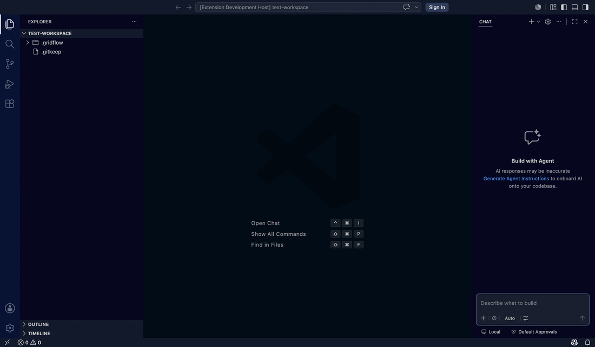

**A work item's full execution trail.** Open any row's detail drawer for status, agent/model, inputs/outputs, dependencies, files touched, tokens, cost, duration, and per-run history.

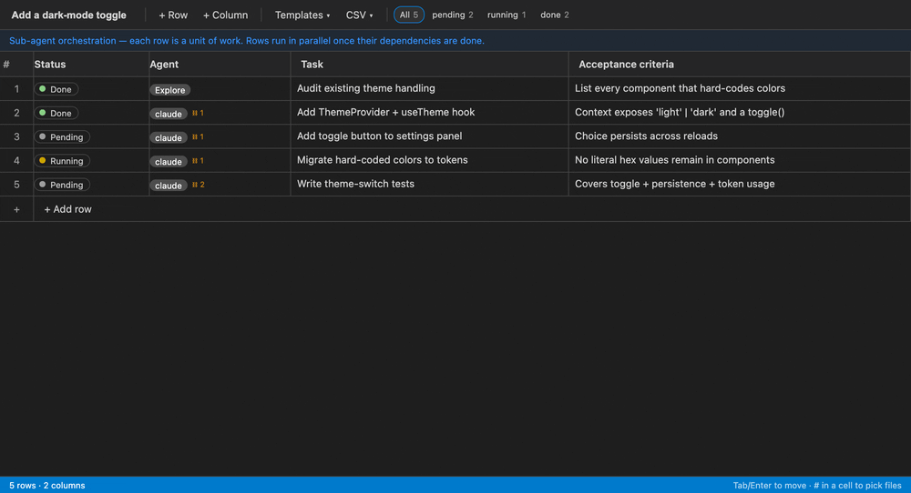

**Edit the grid like a spreadsheet.** Type into cells, add rows, Tab/Enter to move.

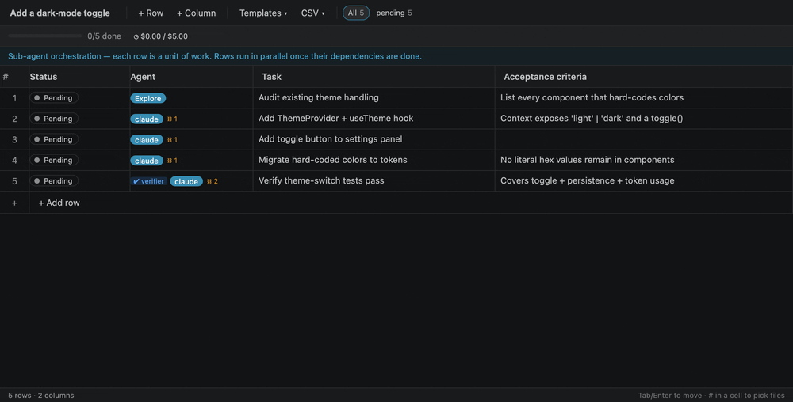

**Reference files and context with `#`.** Type `#` in any cell for `#codebase`, `#errors`, `#selection`, or a file — the token is preserved for the agent to resolve.

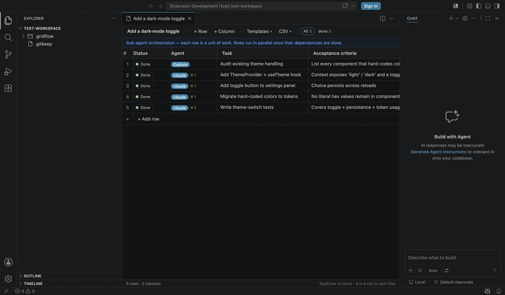

### More in action (0.3.0)

**Replay a single failed node.** Open a failed row, expand its run to see the *exact inputs GridFlow captured* (its prompt plus the upstream output), then re-queue just that node — no upstream re-run.

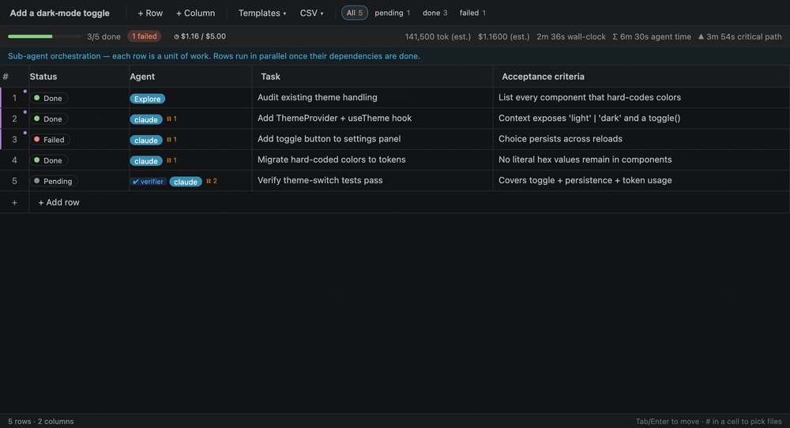

**Wire dependencies and watch outputs flow.** Add a dependency and the parent's output is pulled in as resolved input context (edge-state propagation along the DAG).

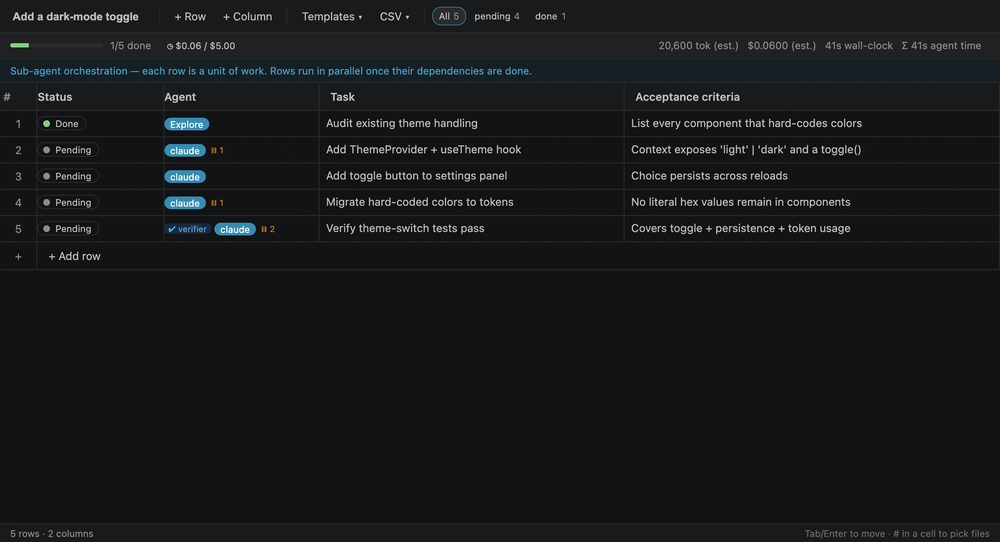

**Fan out over a list.** Turn one template row into N parallel tasks — one per item — with `{{item}}` substitution.

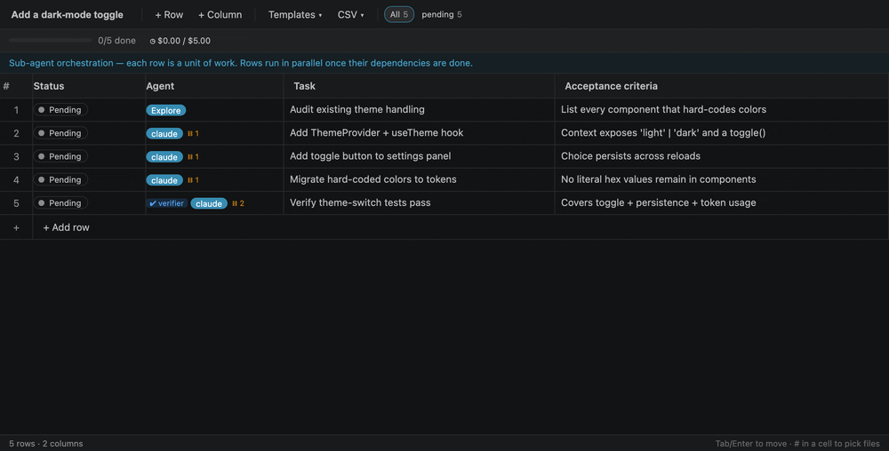

**Cap the spend.** Set a token/cost budget; when spend passes the cap the meter turns red and dispatch halts.

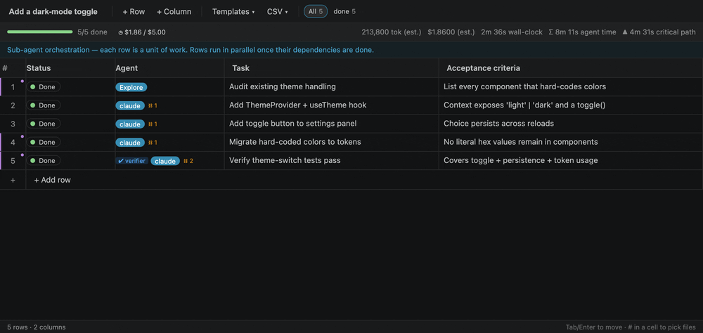

**Don't repeat a known failure.** Opening a row about to touch a file a prior failed run stumbled on raises a deterministic warning.

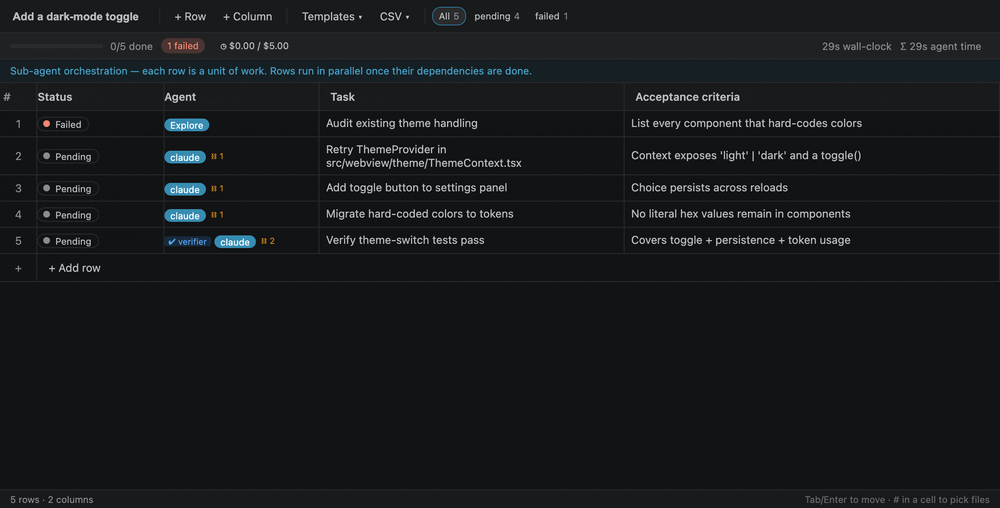

**Audit-grade compliance.** Every update is recorded in a tamper-evident, hash-chained audit trail; the 🔒 indicator shows it's active, and `verifier` rows mark the evaluation steps.

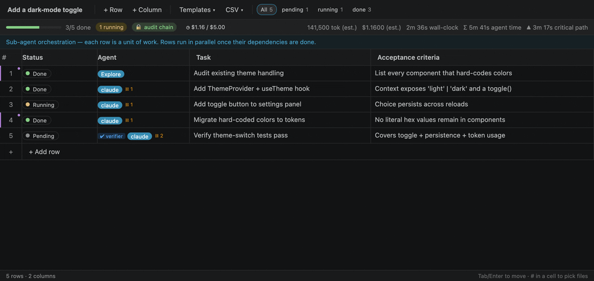

> These GIFs are generated reproducibly — the close-ups drive the real webview bundle, the full-IDE clips drive a real VS Code instance. The agent-orchestration clip pairs the real GridFlow panel with a reconstructed Claude chat (a faithful dramatization of the tool-call loop). See [scripts/demo/](scripts/demo/).

## What it does

1. **AI workflows (flagship).** Run `GridFlow: Open AI Workflow…` to create a workflow grid where every row is a work item. Click a row to open a detail drawer showing status, assigned agent, inputs/outputs, attached evidence files, and an at-a-glance summary — *files read, files modified, tool calls, sub-agents spawned, tokens, cost, duration, runs*. Workflows persist to a human-readable `.gridflow/<name>.json` sidecar so the rich metadata is diffable and committable, while your CSV/TSV files stay clean.
2. **Structured input for chat sessions.** Copilot Chat and compatible agents (like Claude Code) can invoke `#gridflow` to pop open a typed grid, wait for you to fill it in, and receive the result as JSON. Best for orchestrating sub-agents, drafting API specs, enumerating test cases — anything faster to type as a table than as prose.
3. **Custom editor for `.csv` / `.tsv` files.** Right-click any CSV in the Explorer and choose **Open in GridFlow**. Full inline editing with sticky headers, saved through VS Code's normal dirty/save flow.
4. **Standalone grid command.** Run `GridFlow: Open New Grid` for a scratch table — pick a template, fill it in, export to CSV, or send to a chat agent.

The UI inherits your active VS Code theme (light, dark, high contrast) automatically via CSS variables.

## AI workflows — sub-agent orchestration

A GridFlow workflow is a **sub-agent orchestration board**, not a to-do list. When you ask an agent to "spawn sub-agents" or run a multi-step task, it designs a grid for the job and dispatches a sub-agent per row — running independent tasks in parallel and chaining dependent ones — while GridFlow tracks every run.

Each row is a **work item**:

| Field | Set by | Notes |
|-------|--------|-------|
| Cells (columns) | the agent designs them | columns represent what *you* asked for — there is no fixed template |
| Status | you / agent | `pending`, `queued`, `running`, `blocked`, `done`, `failed`, `cancelled` |
| Assigned agent / model | you / agent | which sub-agent runs this row (shown as a chip in the grid) |
| Depends on | agent | other rows that must finish first; rows with no pending deps run in parallel (a DAG) |
| Inputs / outputs | you / agent | the prompt handed to the sub-agent, and its result |
| Duration | **measured by GridFlow** | wall-clock time between `running` and a terminal status — populates automatically |
| Tokens & cost | agent (reported) + **estimated by GridFlow** | when an agent reports tokens without cost, GridFlow estimates cost from a built-in (overridable) pricing table |
| Execution history | agent (reported) | per-run provenance: prompt, context, files read/modified, tool calls, sub-agents, logs |
| File claims | **verified by GridFlow** | every reported file is checked against the filesystem — reads for existence, modifications for an mtime inside the run window — and badged ✓ verified / ? unverified / ✗ missing |

GridFlow is the **cockpit, not the runner** — the agent spawns and runs the sub-agents; GridFlow structures the work, **independently verifies what they claim to have done**, and shows you exactly what each one did.

### The orchestration loop

Both **GitHub Copilot** (via VS Code language-model tools) and **Claude Code** (via the bundled MCP server) drive workflows through the same tools:

1. **`gridflow_openWorkflow`** — the agent **designs the grid** (columns + one row per sub-agent task, with `agent` and `dependsOn` set) and opens it. **The call blocks** while a banner prompts you to review and tweak agent assignments. Click **Start Workflow ▸** and the finalized grid — with row ids and a `readyRowIds` list (tasks whose dependencies are satisfied) — is handed back.
2. The agent **dispatches a sub-agent per ready row, in parallel**, reporting `status: "running"` for each as it starts (GridFlow begins timing).
3. **`gridflow_updateRow`** — as each sub-agent returns, the agent reports `status: "done"`/`"failed"`, `outputs`, provenance (files read/modified, tool calls, sub-agents spawned), and tokens/cost. The grid updates **live** and the response returns the new `readyRowIds` so the next wave can start.
4. **`gridflow_addRows`** — if orchestration uncovers new work, the agent adds rows on the fly.
5. **`gridflow_getWorkflow`** — read the whole board back as structured context instead of re-reading the chat.

Example prompt (Copilot agent mode or Claude Code):

```
Spawn sub-agents to modernise our auth. Use gridflow_openWorkflow — design columns
that fit the job, add a row per sub-agent task, and set dependencies so research runs
first and the three implementation tasks run in parallel after it. Wait for me to
confirm agent assignments, then run them and report each one's progress and cost.
```

One-click **replay** / **branching** build on this same execution-history model.

## Connecting an agent

GridFlow works with both **GitHub Copilot** and **Claude Code** inside VS Code. Copilot needs no setup; Claude Code needs a one-time MCP registration. Both are covered below.

### GitHub Copilot — zero setup

GridFlow contributes its tools as VS Code **language-model tools**, so they're available the moment the extension is installed. There are three ways to use them:

1. **Agent mode (recommended).** In Copilot Chat's *Agent* mode, just describe a multi-step task ("research the auth flow, then refactor it in parallel"). Copilot calls `gridflow_openWorkflow`, `gridflow_updateRow`, `gridflow_addRows`, and `gridflow_getWorkflow` on its own.
2. **The `@gridflow` chat participant.** Type `@gridflow` in Copilot Chat to talk to GridFlow directly. Subcommands: `@gridflow /workflow` (open a workflow), `@gridflow /grid` (open a structured-input grid), `@gridflow /status` (read the current workflow state).
3. **`#`-references in any chat.** Drop `#gridflowWorkflow` (open an AI workflow) or `#gridflow` (open a structured-input grid) into a normal Copilot Chat prompt to pull the grid into that turn.

> **Recommended for reliable orchestration:** in plain agent mode the model follows the tool descriptions, but a workspace instruction file makes it consistently update rows and report files read/modified. Copy [`plugin/templates/copilot-instructions.md`](plugin/templates/copilot-instructions.md) to `.github/copilot-instructions.md` in your project. See [plugin/README.md](plugin/README.md) for the full agent-plugin option.

### Claude Code — one-time MCP setup

Claude Code reaches GridFlow through a local MCP server (default port `54321`) and a tiny stdio proxy that the extension writes to `~/.gridflow/proxy.js` automatically on activation.

**The easy way (recommended):**

1. Open the Command Palette (`Cmd/Ctrl+Shift+P`) and run **GridFlow: Configure Claude Desktop App**. This registers GridFlow with Claude for you, using a portable Node runtime that works on macOS, Linux, and Windows (no hardcoded paths).
2. Run **Developer: Reload Window**.
3. Verify in a terminal: `claude mcp list` should show `gridflow: ✓ Connected`.

**The manual way (if you prefer copy-paste):**

Run **GridFlow: Show MCP Configuration** from the Command Palette. It generates the exact `claude mcp add-json gridflow …` command *for your machine* — copy it, run it in a terminal, then reload the window. (Use this command rather than typing the registration by hand; the Node runtime path is machine-specific and the panel fills it in correctly.)

**Notes:**

- Registration writes to `~/.claude.json` under `mcpServers` — the location both the Claude Code CLI and its VS Code extension read from.
- The `/mcp` panel in Claude only lists *cloud* servers; a local stdio server like GridFlow works but won't appear there. Always verify with `claude mcp list`.
- VS Code must be open with GridFlow running for the proxy to connect — the MCP server lives inside the extension (or run `gridflow serve` for a headless server, below).

### Any other MCP client — Streamable HTTP (no proxy)

GridFlow also serves the modern **Streamable HTTP** MCP transport at `http://127.0.0.1:54321/mcp`, so clients that support it (Claude Code, Gemini CLI, Codex CLI, Cline, Continue, …) connect directly — no stdio proxy. Authenticate with the `x-gridflow-token` header (value in `~/.gridflow/token`; it persists across reloads):

```bash
claude mcp add --transport http gridflow http://127.0.0.1:54321/mcp \
  --header "x-gridflow-token: $(cat ~/.gridflow/token)" -s user
```

Run **GridFlow: Show MCP Configuration** for ready-made snippets.

## Beyond VS Code — CLI, web dashboard, HTTP API

**The `gridflow` CLI.** `lint` is a CI gate (it exits non-zero on a dependency cycle); `plan` prints the topological execution waves.


**The live web dashboard.** A self-contained, read-only browser view served by the extension (or `gridflow serve`) — progress bars, per-row status, cost, and outputs, polling live.

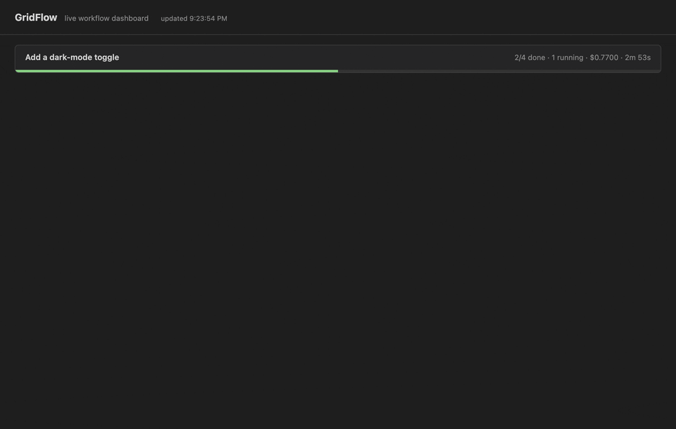

The `.gridflow/*.json` sidecars are the source of truth, so the cockpit isn't locked to the webview:

- **Web dashboard** — run **GridFlow: Open Web Dashboard** (or visit `http://127.0.0.1:54321/dashboard?token=…`) for a live, read-only browser view of every workflow: progress bars, per-row status, agents, cost, outputs. Self-contained HTML, polls every 2s — embeddable wherever a browser runs.
- **HTTP API** — `GET /api/workflows` and `GET /api/workflows/<slug>` return workflow state as JSON (token via `x-gridflow-token` header or `?token=`), so external platforms can integrate GridFlow without speaking MCP.
- **`gridflow` CLI** (`cli/`, zero runtime dependencies):
  - `gridflow watch [dir]` — live terminal dashboard of the workspace's workflows.
  - `gridflow report <workflow>` — print a markdown audit report (summary table + per-row provenance with verification badges) — paste straight into a PR description.
  - `gridflow lint [dir]` — validate every workflow (dependency cycles, dangling deps, missing budget); **exits non-zero on errors**, so it drops straight into CI.
  - `gridflow plan <workflow>` — print the topological execution waves (what runs in parallel, in what order).
  - `gridflow serve [--port N] [--dir path]` — **headless GridFlow**: the same MCP tools, API, and dashboard with no VS Code running. `gridflow_openWorkflow` returns immediately (there's no panel to confirm), so Claude Code can orchestrate from a plain terminal while you watch via `gridflow watch` or the browser dashboard.

Build it with `node esbuild.mjs --cli-only`; the binary lands at `cli/dist/gridflow.js` (`npm link ./cli` to put `gridflow` on your PATH).

> **Recommended for reliable orchestration:** copy [`plugin/templates/CLAUDE.md`](plugin/templates/CLAUDE.md) into your project's root `CLAUDE.md` so Claude consistently follows the workflow loop and reports provenance. See [plugin/README.md](plugin/README.md) for the full plugin/skill option.

## Features

- **Single-node replay + edge-state propagation:** every run captures the exact inputs it was given (its prompt plus a snapshot of each dependency's outputs); `gridflow_replayRow` re-runs one failed node with those inputs **without** re-running upstream. Ready rows are returned with their dependency outputs already resolved.
- **Workflow budget cap:** set a cost/token ceiling; dispatch halts when it's spent (summary-bar meter + editor)
- **Fan-out / map:** expand one template row into N parallel rows over a list (`{{item}}` substitution), by tool or right-click
- **Pre-action file-risk gate:** warns before a row touches a file a prior failed run stumbled on
- **Critical-path highlight:** the duration bottleneck (longest dependency chain) marked in the grid and summary bar
- **CLI `lint` / `plan`:** validate workflows as a CI gate and print the parallelism waves (see *Beyond VS Code* below)
- **Rows as work items:** status, assigned agent, inputs/outputs, evidence files, token/cost, and execution history per row, in an expandable detail drawer — status and dependencies are editable in place, terminal rows can be **re-queued** with one click
- **Verified provenance:** GridFlow cross-checks every file an agent claims to have read or modified against the real filesystem and badges each claim ✓ verified / ? unverified / ✗ missing
- **Workflow summary bar:** progress, running/failed counts, and estimated tokens/cost/duration at a glance; running rows show live elapsed time
- **Cycle-safe DAG:** dependency edges that would deadlock the workflow are rejected and reported; stale `running` rows (agent died) are flagged to the orchestrator
- **Markdown audit reports:** one command turns a workflow into a PR-ready report with per-row provenance
- **Workflows tree view:** every `.gridflow/` workflow with live status counts in the Explorer sidebar, plus a completion notification when the last row lands
- **Sidecar persistence:** workflows live in `.gridflow/<name>.json` — diffable, committable, portable; parallel agent updates are serialized through a per-workflow lock so no run is ever lost
- **Column types:** text, select (dropdown), number, boolean
- **Keyboard navigation:** Tab / Enter to move between cells, arrow keys for directional navigation, `ArrowDown` on the last row appends a new row
- **`#` file references in cells:** type `#` in any text cell to pick a workspace file, `#codebase`, `#errors`, or `#selection` — tokens are preserved in JSON output for downstream agents
- **Template management:** built-in templates (read-only, hideable), plus workspace-scoped and global custom templates with rename/delete/edit
- **CSV import / export:** from file or pasted text; delimiter auto-detected; exports neutralize formula injection (`=`, `+`, `-`, `@`) by default
- **Custom CSV editor** registered at `option` priority — VS Code keeps the default text editor as primary

## Keyboard reference

| Key | Action |
|-----|--------|
| `Tab` / `Shift+Tab` | Move focus right / left |
| `Enter` | Commit and move down |
| `Shift+Enter` | New line within a cell |
| `Escape` | Cancel edit |
| `F2` | Enter edit mode |
| `ArrowDown` on last row | Commit and append a new row |
| `#` on an empty cell | Open file reference picker |
| `Space` on a boolean cell | Toggle checkbox |

## Agent tools reference

GridFlow exposes the same four tools to both Copilot (VS Code language-model tools) and Claude (MCP):

| Tool | Blocks? | Purpose |
|------|---------|---------|
| `gridflow_openWorkflow` | yes — until **Start Workflow** | Agent designs the grid (columns + sub-agent rows + dependencies), opens it, waits for the user, returns the finalized grid with row ids + `readyRowIds` |
| `gridflow_addRows` | no | Add more sub-agent task rows to a running workflow |
| `gridflow_updateRow` | no | Report a row's status, outputs, provenance, tokens, and cost; grid updates live (duration is auto-measured) |
| `gridflow_getWorkflow` | no | Read the current state of all rows as structured context |
| `gridflow_collectStructuredInput` | yes — until **Send to Chat** | One-shot form fill; returns rows as JSON |

### Structured input (one-shot)

Reference `#gridflow` in Copilot Chat or invoke `gridflow_collectStructuredInput` from an agent. The result returned to the chat is a JSON object:

```json
{
  "columns": [
    { "name": "Agent", "type": "select", "options": ["Explore", "Plan", "claude"] },
    { "name": "Task",  "type": "text" }
  ],
  "rows": [
    { "Agent": "Explore", "Task": "Find auth middleware" }
  ],
  "references": ["#file:src/auth.ts", "#codebase"]
}
```

**Tool input schema:**

| Field | Type | Notes |
|-------|------|-------|
| `title` | string | Panel title |
| `templateId` | string | `subagent-orchestration`, `api-endpoints`, `test-cases`, or a custom template id |
| `columns` | array | Column definitions (id, name, type, options, placeholder) |
| `rows` | array | Pre-populated rows (objects keyed by column id or name) |
| `instructions` | string | Hint shown above the grid |

The tool times out after 30 minutes if no input is submitted.

## Commands

| Command | Description |
|---------|-------------|
| `GridFlow: Open AI Workflow…` | Create or reopen a `.gridflow/` workflow of work items |
| `GridFlow: Open New Grid` | Open a blank grid using the default template |
| `GridFlow: Open From Template…` | Pick a template from a quick-pick list |
| `GridFlow: Manage Templates` | Open the template manager panel |
| `GridFlow: Open Active File in Grid` | Open the active `.csv`/`.tsv` in the grid editor |
| `GridFlow: Export Workflow Audit Report…` | Generate a markdown report (summary + per-row provenance) for any workflow |
| `GridFlow: Open Web Dashboard` | Open the live browser dashboard for this workspace's workflows |
| `GridFlow: Show MCP Configuration` | Show copy-paste setup for connecting Claude Code and other MCP clients |
| `GridFlow: Configure Claude Desktop App` | One-click register GridFlow with the Claude desktop app |

## Settings

| Setting | Default | Description |
|---------|---------|-------------|
| `gridflow.defaultTemplate` | `subagent-orchestration` | Template used by `Open New Grid` |
| `gridflow.csvDelimiter` | `auto` | Delimiter for CSV parsing/export (`auto`, `,`, `;`, `\t`, `\|`) |
| `gridflow.mcpPort` | `54321` | Port for the local server (MCP, HTTP API, web dashboard). Set to `0` to disable. |
| `gridflow.csvSafeExport` | `true` | Escape `=`, `+`, `-`, `@` at the start of exported string cells (formula-injection guard) |
| `gridflow.modelPricing` | `{}` | Override/extend the built-in $/MTok pricing table used for cost estimates |

## Advanced features

These advanced modules are **built in and always on** — fully open source, no gate, no sign-in.

- **Audit-grade compliance** — every workflow update is recorded in a SHA-256 **hash-chained, tamper-evident** audit trail (`.gridflow/<slug>.aat.jsonl`, IETF Agent Audit Trail format). **GridFlow: Verify Audit Chain** re-hashes it and reports any alteration; **GridFlow: Export Compliance Attestation** writes a `session_hash` attestation. Built for the EU AI Act (effective Aug 2026) and SOC 2 trails — the property `git` can't give you (it proves history was *editable*; this proves it *wasn't*).
- **Verification & adaptive replanning** — mark rows as `verifier`; `gridflow_verifyWorkflow` scores completeness against them, recommends stop/continue, and can append a gap-filling sub-DAG.
- **Model advisor** — `gridflow_suggestModel` recommends the most cost-effective capable model for a row from your own run history.
- **Governance** — `gridflow_projectMemory` flags files that have failed in *any* workflow across the repo before a row touches them.

**How it's built:** each module is a self-contained folder under [`src/extension/`](src/extension/) (`compliance/`, `verify/`, `advisor/`, `governance/`) with a pure, `vscode`-free `evaluate.ts`/`aat.ts` core that's unit-tested, plus an `index.ts` doing the VS Code / MCP wiring. The three MCP tools are aggregated in [`src/extension/featureTools.ts`](src/extension/featureTools.ts).

## License

GridFlow — the extension, CLI, and MCP server — is **MIT**. See [`LICENSE`](LICENSE).
